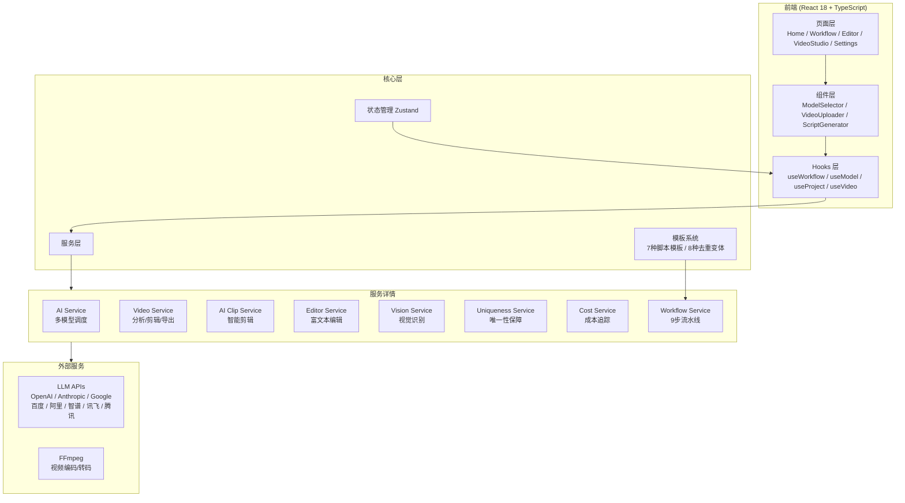

```
  ____ _ _       _____ _
 / ___| (_)_ __ |  ___| | _____      __
| |   | | | '_ \| |_  | |/ _ \ \ /\ / /
| |___| | | |_) |  _| | | (_) \ V  V /
 \____|_|_| .__/|_|   |_|\___/ \_/\_/
           |_|
```

<p align="center">
  <strong>ClipFlow — AI 驱动的专业视频内容创作平台</strong>
</p>

<p align="center">
  
  
  
  
  
  
</p>

---

## 📖 简介

**ClipFlow** 是一款面向影视创作者和内容创作者的专业 AI 视频内容创作平台，提供智能脚本生成、视频分析、自动混剪和原创性保障。通过 9 步智能工作流，从视频上传到成品导出全链路覆盖。

> 📄 **许可声明**：本项目采用 [MIT License](./LICENSE)
>
> 📝 **更名历史**：ReelForge → **ClipFlow** (2026-02-19)

### ✨ 核心优势

- 🤖 **多模型 AI 脚本生成** — 8 大 AI 提供商、7 种脚本模板、6 种风格可选
- 🎬 **智能视频分析** — 场景检测（颜色直方图 Chi-Square 算法）、关键帧提取、内容摘要
- ✂️ **AI 智能剪辑** — 场景切换检测、静音移除、节奏调整、自动转场
- 🔒 **原创性保障** — 内容指纹 + 语义去重 + 8种去重变体 + 唯一性检测
- 💰 **成本追踪** — 实时 Token 用量和 API 调用成本统计
- 🖥️ **跨平台** — 基于 Tauri 的桌面应用，支持 macOS / Windows / Linux

---

## 🔄 9 步智能工作流

```
上传 → 分析 → 模板选择 → 脚本生成 → 去重优化 → 唯一性保障 → 脚本编辑 → 时间轴 → 导出
```

### Step 1: 📤 视频上传

| 项目 | 说明 |
|------|------|
| **输入** | 视频文件（MP4 / MOV / WebM / AVI，最大 1GB） |
| **处理** | 拖拽上传、格式检测、元数据提取（时长/分辨率/帧率） |
| **输出** | `VideoInfo` — 标准化视频信息对象，关联到项目 |

### Step 2: 🔍 智能分析

| 项目 | 说明 |
|------|------|
| **输入** | `VideoInfo` 视频数据 |
| **处理** | 颜色直方图差异场景检测、关键帧采样、对象识别、情绪检测 |
| **输出** | `VideoAnalysis` — 场景列表、关键帧、分析摘要 |

### Step 3: 📋 模板选择

| 项目 | 说明 |
|------|------|
| **输入** | `VideoAnalysis` + 用户偏好 |
| **处理** | 基于视频特征自动推荐模板；支持手动选择 |
| **输出** | `ScriptTemplate` — 7种模板之一（专业/轻松/幽默/情感/技术/营销/叙事） |
| **模板** | 每个模板包含结构定义（开场/主体/转场/结尾/CTA）、字数指导、写作提示 |

### Step 4: 📝 AI 脚本生成

| 项目 | 说明 |
|------|------|
| **输入** | 模板结构 + 视频分析 + 风格/语气/长度参数 |
| **处理** | 按模板段落逐段调用 AI 生成解说词；场景信息注入 Prompt |
| **输出** | `ScriptData` — 完整脚本（含分段、元数据、字数统计、预估时长） |

### Step 5: 🔄 去重优化

| 项目 | 说明 |
|------|------|
| **输入** | 生成的脚本 |
| **处理** | 三重检测（精确匹配 / 语义相似 / 模板重复）+ 8种变体策略自动修复 |
| **输出** | 去重后脚本 + 原创性报告（评分/重复项/修改建议） |
| **变体** | 保守型 / 平衡型 / 激进型 / 创意型 / 学术型 / 口语型 / 诗意型 / 技术型 |

### Step 6: 🔒 唯一性保障

| 项目 | 说明 |
|------|------|
| **输入** | 去重后脚本 |
| **处理** | 内容指纹生成 → 历史库对比 → 相似度超标自动重写（最多3轮） → 随机性注入 |
| **输出** | 唯一性验证通过的脚本 + 唯一性报告 |

### Step 7: ✏️ 脚本编辑

| 项目 | 说明 |
|------|------|
| **输入** | 唯一性验证后的脚本 |
| **处理** | 富文本编辑器；段落增删调整；版本历史；实时字数/时长统计 |
| **输出** | 最终脚本，保存到项目 |

### Step 8: 🎬 时间轴编辑

| 项目 | 说明 |
|------|------|
| **输入** | 脚本 + 视频分析 + 视频信息 |
| **处理** | 自动匹配脚本段落与视频场景；三轨时间轴（视频/音频/字幕）；转场设置 |
| **输出** | `TimelineData` — 多轨时间轴（含片段、时间码、转场效果） |

### Step 9: 📦 导出发布

| 项目 | 说明 |
|------|------|
| **输入** | 时间轴 + 导出设置 |
| **处理** | 自动生成 SRT 字幕 → FFmpeg 编码（libx264 + AAC）→ 导出记录保存 |
| **输出** | 成品视频（MP4 / WebM / MOV，720p ~ 4K） |

---

## 🏗️ 技术架构



---

## 🤖 支持的 AI 模型 (2026)

| 提供商 | 模型 | 特点 |
|--------|------|------|
| **OpenAI** | GPT-5 | 综合能力最强 |
| **Anthropic** | Claude Opus 4.6 | 长文本理解优秀 |
| **Google** | Gemini 3 | 多模态能力 |
| **百度** | ERNIE 5.5 | 中文优化 |
| **阿里** | Qwen 3.5 | 性价比高 |
| **智谱** | GLM-5 | 多模态理解 |
| **讯飞** | Spark X1 | 语音集成 |
| **MiniMax** | MiniMax-01 | 长文本生成 |

---

## 🚀 快速开始

### 环境要求

- Node.js ≥ 18
- pnpm 或 npm
- Rust（Tauri 桌面端需要）
- FFmpeg（视频导出需要）

### 安装运行

```bash
# 克隆项目
git clone https://github.com/Agions/clip-flow.git
cd clip-flow

# 安装依赖
npm install

# 启动开发服务器
npm run dev

# 构建生产版本
npm run build

# 启动 Tauri 桌面应用
npm run tauri dev
```

### 配置 API 密钥

进入 **设置页面** → API 配置，添加至少一个 AI 模型的密钥即可开始使用。

---

## 📁 项目结构

```
src/
├── core/                           # 核心层
│   ├── api/client.ts               # 统一 HTTP 客户端
│   ├── config/
│   │   ├── app.config.ts           # 应用配置
│   │   └── models.config.ts        # AI 模型配置
│   ├── constants/index.ts          # 全局常量
│   ├── hooks/                      # 业务 Hooks
│   │   ├── useWorkflow.ts          # 工作流管理
│   │   ├── useModel.ts             # 模型选择
│   │   ├── useProject.ts           # 项目管理
│   │   └── useVideo.ts             # 视频操作
│   ├── services/                   # 业务服务
│   │   ├── workflow.service.ts     # ⭐ 9步工作流引擎
│   │   ├── ai.service.ts           # 多模型 AI 调度
│   │   ├── video.service.ts        # 视频处理 / FFmpeg
│   │   ├── aiClip.service.ts       # AI 智能剪辑
│   │   ├── vision.service.ts       # 视觉识别
│   │   ├── editor.service.ts       # 编辑器服务
│   │   ├── uniqueness.service.ts   # 唯一性保障
│   │   ├── cost.service.ts         # 成本追踪
│   │   ├── storage.service.ts      # 本地存储
│   │   ├── base.service.ts         # 服务基类
│   │   └── index.ts                # 统一导出
│   ├── stores/                     # Zustand 状态管理
│   ├── templates/                  # 模板系统
│   │   ├── script.templates.ts     # 7种脚本模板
│   │   ├── dedup.templates.ts      # 去重模板
│   │   └── dedup.variants.ts       # 8种去重变体
│   ├── types/index.ts              # 全局类型
│   └── utils/                      # 工具函数
├── components/                     # UI 组件
│   ├── business/                   # 业务组件
│   │   ├── ModelSelector/          # 模型选择器
│   │   ├── VideoUploader/          # 视频上传
│   │   ├── ScriptGenerator/        # 脚本生成器
│   │   ├── ScriptGeneratorV2/      # 优化版脚本生成
│   │   └── editor/                 # 编辑器组件
│   ├── common/                     # 通用组件
│   └── layout/                     # 布局组件
├── pages/                          # 页面
│   ├── Home/                       # 首页
│   ├── Workflow/index.tsx          # ⭐ 9步工作流页面
│   ├── Editor/                     # 编辑器
│   ├── VideoStudio/                # 视频工作室
│   └── Settings/                   # 设置
├── context/                        # React Context
├── layouts/                        # 布局
└── utils/                          # 工具（i18n等）

src-tauri/                          # Tauri 桌面端 (Rust)
docs/                               # 项目文档
```

---

## 🛠️ 技术栈

| 类别 | 技术 |
|------|------|
| **前端框架** | React 18 + TypeScript 5 |
| **构建工具** | Vite 4 |
| **UI 组件** | Ant Design 5 |
| **状态管理** | Zustand 4 |
| **动画** | Framer Motion |
| **样式** | Less + CSS Modules |
| **桌面端** | Tauri (Rust) |
| **视频处理** | FFmpeg (via Tauri Shell) |
| **代码规范** | ESLint + Prettier |

---

## 🤝 参与贡献

1. Fork 本仓库
2. 创建特性分支 (`git checkout -b feature/amazing-feature`)
3. 提交更改 (`git commit -m 'feat: add amazing feature'`)
4. 推送分支 (`git push origin feature/amazing-feature`)
5. 提交 Pull Request

### 提交规范

- `feat:` 新功能
- `fix:` 修复
- `docs:` 文档
- `refactor:` 重构
- `perf:` 性能优化

---

## 📄 许可证

本项目采用 [MIT License](./LICENSE) 开源。

---

<p align="center">
  <strong>ClipFlow</strong> — 让创作更高效
</p>
